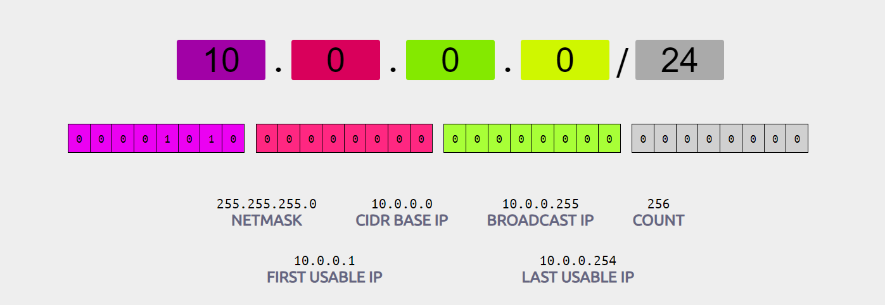
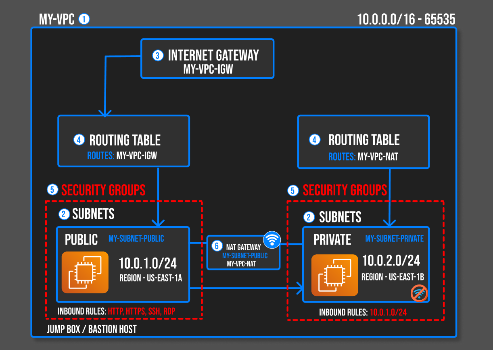
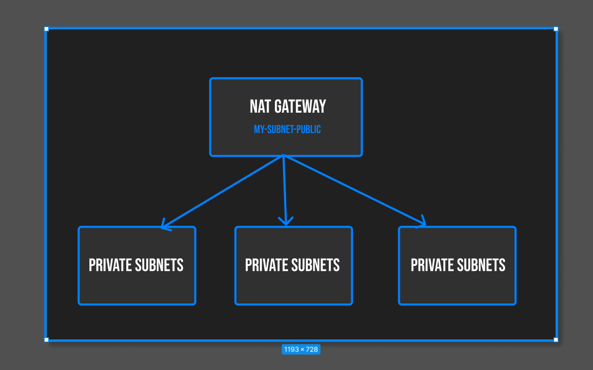

# VIRTUAL PRIVATE CLOUD

<div align="center">

</div>

<br>

Amazon Web Services (AWS) Virtual Private Cloud (VPC) is a service that allows you to create a private, isolated network within the AWS cloud. With VPC, you can launch resources in a virtual network that you define. VPC provides you with complete control over your virtual networking environment, including IP addressing, subnets, routing tables, and network gateways.

> [!NOTE]
> A VPC is a virtual network that closely resembles a traditional network that you'd operate in your own data center. After you create a VPC

## ⭐ IP Address

An IP address (Internet Protocol address) is a unique identifier assigned to each device connected to a computer network that uses the Internet Protocol for communication. It serves two main functions: identifying the host or network interface and providing the location of the host in the network.

> [!IMPORTANT]
> [0-255].[0-255].[0-255].[0-255]

### ⚡ Types of IP Addresses

1. **IPv4 (Internet Protocol version 4)**: 
   - Format: 32-bit numeric address written as four decimal numbers separated by periods (e.g., 192.168.1.1).
   - Range: Supports approximately 4.3 billion unique addresses.
   - Example: `192.168.0.1`

2. **IPv6 (Internet Protocol version 6)**:
   - Format: 128-bit address written as eight groups of four hexadecimal digits separated by colons (e.g., 2001:0db8:85a3:0000:0000:8a2e:0370:7334).
   - Range: Supports a vastly larger number of unique addresses (approximately 340 undecillion addresses).
   - Example: `2001:0db8:85a3:0000:0000:8a2e:0370:7334`

## ⭐ CIDR (Classless Inter Domain Routing)

“CIDR” stands for Classless Inter-Domain Routing. In AWS VPC, a CIDR block is the IP address block from which private IPv4 addresses and public IPv4 addresses are allocated when you create a VPC. The CIDR block can range from /28 (16 IP addresses) to /16 (65,536 IP addresses). It represents a network segment and is associated with a network boundary. Upon creation, you cannot change the CIDR block of your VPC, but you can add additional CIDR blocks to it if needed. A VPC’s CIDR block should not overlap with any of the existing network’s CIDR blocks.


### ⚡ CIDR Notation

CIDR is a notation for describing blocks of IP addresses and is used heavily in various networking configurations. IP addresses contain 4 octets, each consisting of 8 bits giving values between 0 and 255. The decimal value that comes after the slash is the number of bits consisting of the routing prefix. This in turn can be translated into a netmask, and also designates how many available addresses are in the block.

CIDR notation is a way to represent IP addresses and their associated routing prefix. An IP address is followed by a slash (/) and a number which specifies the length of the subnet mask.

```
IP_address/Subnet_prefix_length
```

#### 💻 Example

`192.168.1.0/24`: This denotes an IP address where the first 24 bits are used for the network part, and the remaining 8 bits are used for host addresses.

#### 💻 Example

`10.0.0.0/24`: --> `10.0.0.0` to `10.0.0.255`




Here is a table showing the IP ranges from `10.0.0.0/32` to `10.0.0.0/0` along with the total number of IPs for each range:

| CIDR Notation | Start IP      | End IP        | Total IPs         |
|---------------|---------------|---------------|-------------------|
| 10.0.0.0/32   | 10.0.0.0      | 10.0.0.0      | 1                 |
| 10.0.0.0/31   | 10.0.0.0      | 10.0.0.1      | 2                 |
| 10.0.0.0/30   | 10.0.0.0      | 10.0.0.3      | 4                 |
| 10.0.0.0/29   | 10.0.0.0      | 10.0.0.7      | 8                 |
| 10.0.0.0/28   | 10.0.0.0      | 10.0.0.15     | 16                |
| 10.0.0.0/27   | 10.0.0.0      | 10.0.0.31     | 32                |
| 10.0.0.0/26   | 10.0.0.0      | 10.0.0.63     | 64                |
| 10.0.0.0/25   | 10.0.0.0      | 10.0.0.127    | 128               |
| 10.0.0.0/24   | 10.0.0.0      | 10.0.0.255    | 256               |
| 10.0.0.0/23   | 10.0.0.0      | 10.0.1.255    | 512               |
| 10.0.0.0/22   | 10.0.0.0      | 10.0.3.255    | 1,024             |
| 10.0.0.0/21   | 10.0.0.0      | 10.0.7.255    | 2,048             |
| 10.0.0.0/20   | 10.0.0.0      | 10.0.15.255   | 4,096             |
| 10.0.0.0/19   | 10.0.0.0      | 10.0.31.255   | 8,192             |
| 10.0.0.0/18   | 10.0.0.0      | 10.0.63.255   | 16,384            |
| 10.0.0.0/17   | 10.0.0.0      | 10.0.127.255  | 32,768            |
| 10.0.0.0/16   | 10.0.0.0      | 10.0.255.255  | 65,536            |
| 10.0.0.0/15   | 10.0.0.0      | 10.1.255.255  | 131,072           |
| 10.0.0.0/14   | 10.0.0.0      | 10.3.255.255  | 262,144           |
| 10.0.0.0/13   | 10.0.0.0      | 10.7.255.255  | 524,288           |
| 10.0.0.0/12   | 10.0.0.0      | 10.15.255.255 | 1,048,576         |
| 10.0.0.0/11   | 10.0.0.0      | 10.31.255.255 | 2,097,152         |
| 10.0.0.0/10   | 10.0.0.0      | 10.63.255.255 | 4,194,304         |
| 10.0.0.0/9    | 10.0.0.0      | 10.127.255.255| 8,388,608         |
| 10.0.0.0/8    | 10.0.0.0      | 10.255.255.255| 16,777,216        |
| 10.0.0.0/7    | 10.0.0.0      | 11.255.255.255| 33,554,432        |
| 10.0.0.0/6    | 10.0.0.0      | 13.255.255.255| 67,108,864        |
| 10.0.0.0/5    | 10.0.0.0      | 15.255.255.255| 134,217,728       |
| 10.0.0.0/4    | 10.0.0.0      | 19.255.255.255| 268,435,456       |
| 10.0.0.0/3    | 10.0.0.0      | 23.255.255.255| 536,870,912       |
| 10.0.0.0/2    | 10.0.0.0      | 31.255.255.255| 1,073,741,824     |
| 10.0.0.0/1    | 10.0.0.0      | 63.255.255.255| 2,147,483,648     |
---

## ⭐ Algorithm

190.20.5.0/27 

=> 32 (number of hosts) - 27 => 5

=> 2 power 5 => 2 * 2 * 2 * 2 * 2

=> **32**

---

#### 💻 Example 

10.0.0.0/23 ---> 10.0.0.0 - 10.0.1.255 =>  total = 512

10.0.0.0 - 10.0.0.255 => 256

10.0.1.0 - 10.0.0.255 => 256

---

**8.8.8.8**

10.0.0.0/24 = 10.0.0.0 - 10.0.0.255 => total 256

`8.8.8`.8

---

10.0.0.0/16 = 10.0.0.0 - 10.0.255.255 => total 65536

`8.8`.8.8

---
10.0.0.0/8 = 10.0.0.0 - 10.255.255.255 => total 16777216

`8`.8.8.8

---

## ⭐ Public and Private Address


| **Aspect**           | **Public IP Address**                                       | **Private IP Address**                                   |
|----------------------|--------------------------------------------------------------|----------------------------------------------------------|
| **Scope**            | Global, accessible from anywhere on the internet            | Local, accessible only within a specific network         |
| **Assignment**       | Assigned by ISP or cloud provider                            | Assigned by router or network administrator               |
| **Visibility**       | Exposed to the public internet                               | Hidden from the public internet; only visible within local network |
| **Range**            | Any IP address not within private IP ranges                  | Specific ranges (e.g., `10.0.0.0` to `10.255.255.255`)  |
| **Usage**            | Used to identify and communicate with devices across the web | Used for internal communication within a private network |
| **Example**          | `8.8.8.8` (Google's DNS server)                              | `192.168.1.10` (common for devices on a home network)     |


## ⭐ 2-Tier and 3-Tier Architecture


| **Aspect**            | **2-Tier Architecture**                               | **3-Tier Architecture**                              |
|-----------------------|-------------------------------------------------------|------------------------------------------------------|
| **Structure**         | Client Tier and Server Tier                          | Presentation Layer, Application Layer, Data Layer   |
| **Components**        | - Client Application                                  | - Client Application                                |
|                       | - Server (Application + Database)                     | - Application Server                                |
|                       |                                                       | - Database Server                                   |
| **Example in AWS**    | - Client: Web or mobile app                           | - Presentation Layer: Static site on Amazon S3      |
|                       | - Server: EC2 instance with local database            | - Application Layer: EC2 instance or AWS Lambda     |
|                       |                                                       | - Data Layer: RDS instance or DynamoDB              |
| **Pros**              | - Simplicity                                          | - Scalability: Each layer can be scaled independently|
|                       | - Cost-Effective                                      | - Flexibility: Easy to update or replace layers     |
|                       |                                                       | - Maintenance: Issues isolated to specific layers   |
| **Cons**              | - Scalability: Limited, as both application and data are tied together | - Complexity: More components to manage            |
|                       | - Maintenance: Changes affect the entire system       | - Cost: Potentially higher due to multiple services |

### ⚡ 3-Tier Architecture

<div align="center">

</div>

---

## ⭐ STEPS TO CREATE AND SET UP A VPC IN AWS ENVIRONMENT

1. Create a own VPC

2. Create a public and Private subnet for different available Availability zones by assigning CIDR blocks.
3. Create Internet getaway and attach it to the VPC
4. Create Routing Table (RT)   one as public and one as Private by associating the appropriate subnets to it.
5. Edit the public route tables route alone and map the IGW Internet gateway not the private and leave it as it is
6. Create two security groups - one for the public [Edit the Inbound rules with RDP, HTTP/HTTPS, SSH, and map `0.0.0.0/0` in the source] and one for ther private [Edit the inbound rules and map the SG of public in the source]
7. create two EC2s one in public and one in private subnets with proper security groups.
8. Login into public and check the internet connection.
9. Create NAT gateway with new Elastic IP for the internet connection in the private subnet. map it to private RT.
10. Now login into the private EC2 and verify the connectivity and internet facility.

---

### ⚡ Internet Gateway

An Internet Gateway is a horizontally scaled, redundant, and highly available AWS-managed component that enables communication between instances in a VPC and the internet. It provides a target in your VPC route tables for internet-routable traffic, and it performs network address translation (NAT) for instances that have been assigned public IP addresses.





## ⭐ SUBNETS

> [!NOTE]
> A subnet is a range of IP addresses in your VPC. A subnet must reside in a single Availability Zone. After you add subnets, you can deploy AWS resources in your VPC.

Subnets: A subnet is a range of IP addresses in your VPC. You can launch resources, such as EC2 instances and RDS databases, in a subnet. You can also assign different subnets to different availability zones to achieve high availability and fault tolerance.

Subnets or subnetworks in Amazon VPC (Virtual Private Cloud) are divisions of a VPC’s IP address range. You can launch Amazon Elastic Compute Cloud (Amazon EC2) instances into a selected subnet. When you create a subnet, you specify the CIDR block for the subnet, which is a subset of the VPC CIDR block. Each subnet must be associated with a route table, which controls the traffic flow between the subnets. There are two types of subnets: public and private. A public subnet is one in which the associated route table directs the subnet to the Internet Gateway (IGW) of the VPC. A private subnet does not have a route to the IGW and hence has no direct route to the internet.

>[!IMPORTANT]
> A subnet must reside in a single Availability Zone
 
## ⭐ ROUTE TABLES

Route Tables: A route table is a set of rules that determines how traffic is directed in your VPC. You can create multiple route tables and assign them to different subnets to control the flow of traffic.

In AWS, a route table is like a map for your VPC (Virtual Private Cloud). It tells your servers (like EC2 instances) where to send their network traffic, depending on where it’s trying to go.

## ⭐ INTERNET GATEWAY

Internet Gateway: An internet gateway is a horizontally scaled, redundant, and highly available VPC component that allows communication between instances in your VPC and the internet.

An Internet Gateway is a redundant, horizontally scalable component in AWS that performs bi-directional routing between a VPC and the Internet. It serves two purposes; routing outbound traffic from the VPC to the internet (NAT), and routing inbound traffic from the Internet to the VPC. It’s automatically highly available and provides bandwidth and redundancy across all AWS Regions. It becomes associated with a VPC upon creation, and cannot be detached or attached to another VPC once created. Security to and from the Internet Gateway can be controlled using route tables and security groups or network ACLs.

## ⭐ SECURITY GROUPS

Security Groups: Security groups act as a virtual firewall for your instances. You can create security groups to control inbound and outbound traffic for your instances.

Security Groups in AWS act as a virtual firewall for your instance to control inbound and outbound traffic. When you launch an instance in a VPC, you can assign up to five security groups to the instance. Security Groups are stateful — if you send a request from your instance, the response traffic for that request is allowed to flow in regardless of inbound security group rules. You can specify allow rules, but not deny rules. You can specify separate rules for inbound and outbound traffic. Therefore, if you need to allow specific communication between your instances, you’ll need to configure both outbound rules for the sender security group and inbound rules for the receiver security group.

## ⭐ NAT GATEWAY

A network address translation (NAT) gateway enables instances in a private subnet to connect to the internet or other AWS services while preventing the internet from initiating connections with the instances.

A NAT gateway is a Network Address Translation (NAT) service. You can use a NAT gateway so that instances in a private subnet can connect to services outside your VPC but external services cannot initiate a connection with those instances.

---