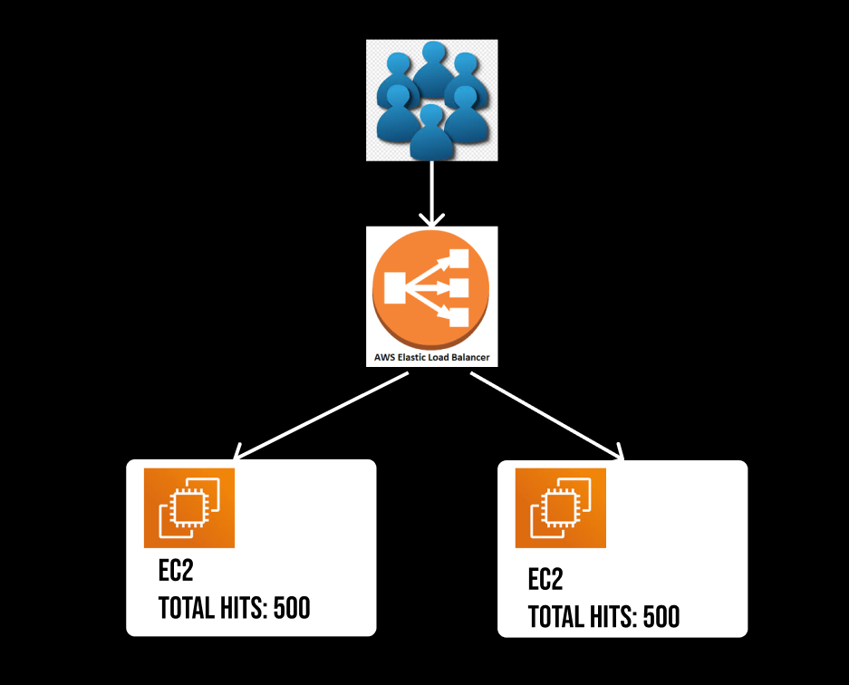
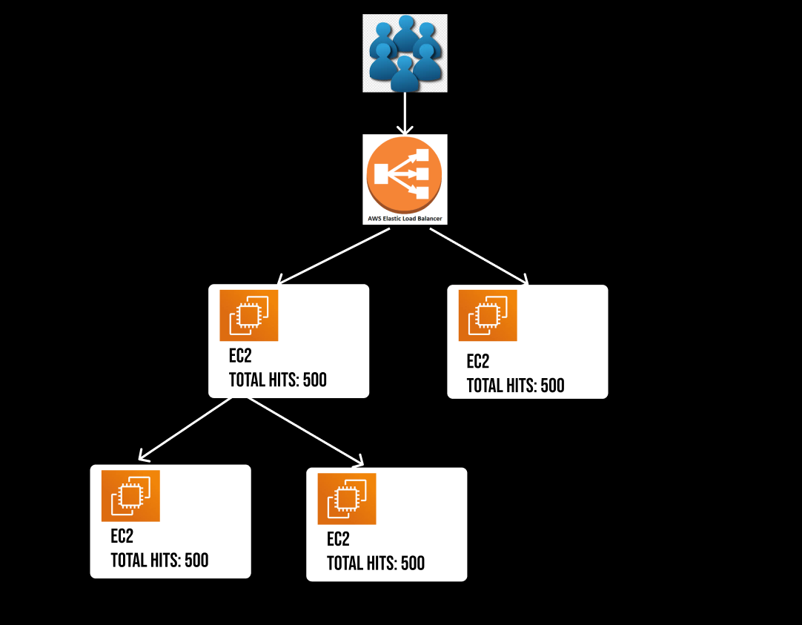
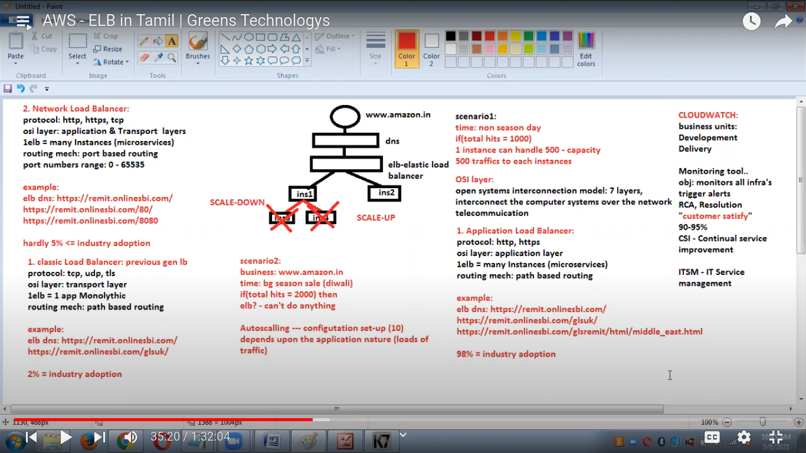
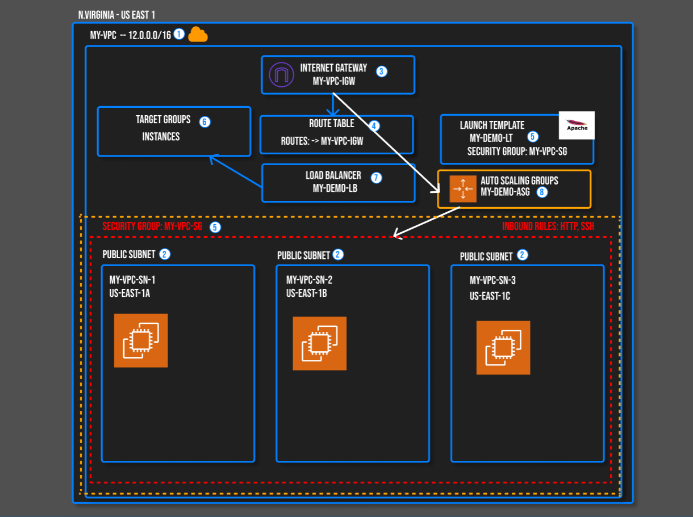

# ELASTIC LOAD BALANCING (ELB)

Elastic Load Balancing automatically distributes incoming application traffic across multiple targets, such as Amazon EC2 instances, containers, IP addresses, and Lambda functions. ELB ensures that no single instance bears too much load, improving fault tolerance and availability.

* Distributes the traffics to available resources (servers)

* Enables parallel processing.

* Assure the fastest performance of the app.

## ⭐ OSI Layers

The OSI (Open Systems Interconnection) model is a conceptual framework used to understand and implement network communications. It divides network functions into seven distinct layers: Physical, Data Link, Network, Transport, Session, Presentation, and Application.

### ⚡ 1. Application Load Balanvers

* **Protocol**: `http`,`https`

* **OSI Layer**: Application layer

* **1 ELB**:  Many Instances (Microservices)

* **Routing mechanism**: Path based routing

* **Industry Adoption**: 98%

Application Load Balancers (ALB) in AWS (Amazon Web Services) are part of the Elastic Load Balancing (ELB) service that helps distribute incoming application traffic across multiple targets, such as Amazon EC2 instances, containers, and IP addresses.

### ⚡ Network Load Balancers

* **Protocol**: `http`,`https`, `tcp`

* **OSI Layer**: Application layer & Transport layer

* **1 ELB**:  Many Instances (Microservices)

* **Routing mechanism**: Port based routing (0-65535)

* **Industry Adoption**: <= 5%

### ⚡ Classic Load Balancers (previous gen LB)

* **Protocol**: `udp`,`tls`, `tcp`

* **OSI Layer**: Transport layer

* **1 ELB**:  1 Instances (Monolythic)

* **Routing mechanism**: Port based routing (0-65535)

* **Industry Adoption**: <= 2%

---

Scenario: 

* **business**: "amazon.com"

* **Time**: Season sale

* **Total Hits**: If(2000)

* **ELB**: Cannot handle (server crashed)

## ⭐ Auto Scaling

Auto Scaling in AWS refers to the capability of automatically adjusting the number of compute resources allocated to your application based on current demand. This ensures that you have the right amount of resources at all times, which improves availability and reduces costs.

> [!NOTE]
> This process refers to scale-up

Scenario: 

* **business**: "amazon.com"

* **Time**: After sale (normal time)

* **Total Hits**: If(1000)

> [!NOTE]
> This process refers to scale-down

---

## ⭐ Autoscaling an EC2 instance for High Availability and stress testing

1. Create a VPC with cidr 10.10.0.0/16

2. Create three public subnets with 10.10.1.0/24 & 10.10.2.0/24 & 10.10.3.0/24

3. Create an autoscaling group using t2.micro instances. All instances should have apache installed on each instance with the ability to check any random IP address and be able to produce a test page. Ensure the autoscaling group is using the public subnets from #2.

4. The autoscaling min and max should be 2 and 5.

5. Create an Application Load Balancer to distribute traffic to the autoscaling group.

6. Create web server security group that allows inbound traffic from HTTP from your Application Load Balancer.

7. Create a load balancer security group that allows inbound traffic from HTTP from 0.0.0.0/0.

