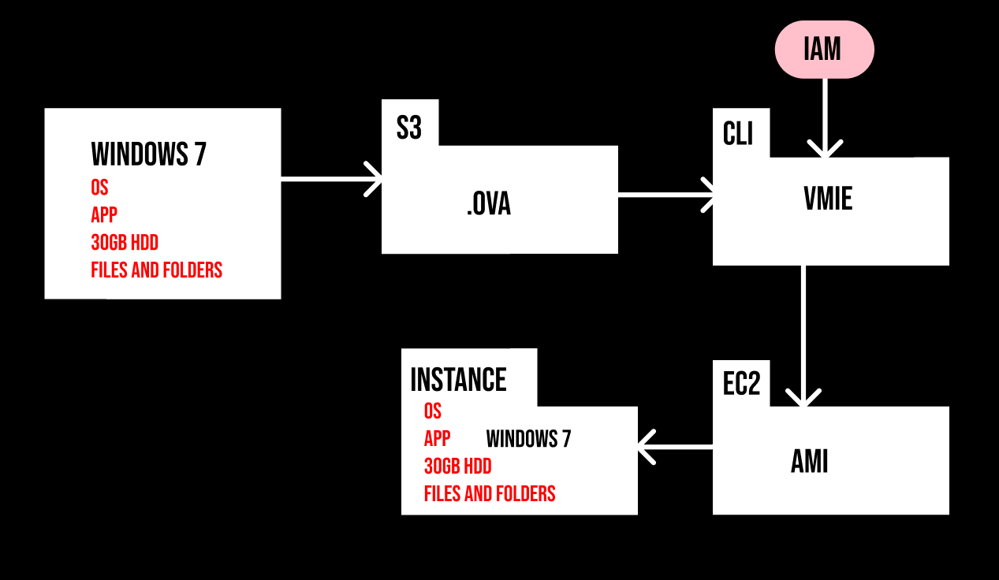

# Cloud Migration

The Process of transferring data, applications, workloads from on-premesis to cloud premesis.

## ⭐ Why Cloud migration?

- Operational costs

- workforce productivity
- cost avoidance
- operational resilience
- business agility

## ⭐ Migration strategies: 6R's

- Re-host: List & Shift

- Re-platform: Lift, Tinker, & Shift

- Re-purchase: Drop & Shop

- Re-architect: Redesign

- Retain: Do nothing for now or Revisit

- Retire: Decomission or get rid of it.

## ⭐ Things to take care before core migration

- cost vs time line

- onpremesis cost:

## ⭐ Hypervisor

A hypervisor, also known as a virtual machine monitor (VMM), is a software, firmware, or hardware component that creates and runs virtual machines (VMs). A hypervisor allows one host computer to support multiple guest VMs by virtually sharing its resources, such as memory and processing power. This enables better utilization of physical resources and provides flexibility in managing workloads.

