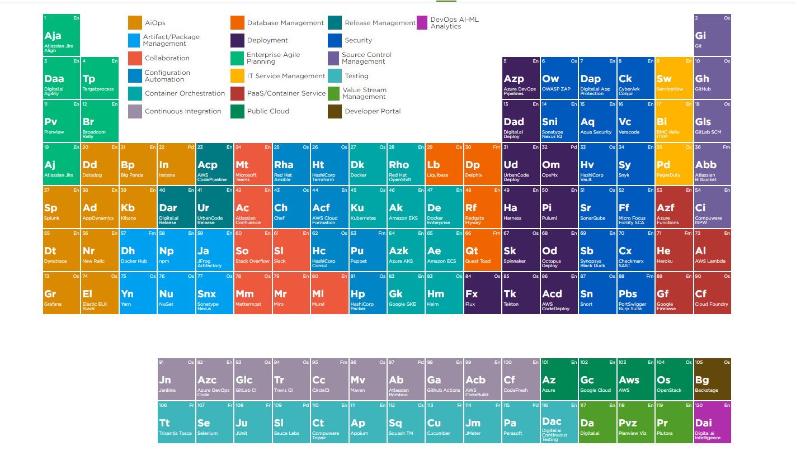

# 🌐 CodeDeploy 

CodeDeploy is a deployment service from AWS which can automate application deployments Amazon EC2 instances, on premises instances or Lambda functions, This does a onetime deployment for scheduling of deployment you may have to use AWS CodePipeline also.

### 📌 Application 

A CodeDeploy application can be defined from AWS CodeDeploy web console

### 📌 Revision

Represents the code need to be deployed on EC2 instance.

### 📌 Appspec file

This contains the instruction to CodeDeploy like copying of files, executng the scripts etc during the code deployment process. it is present in the root directory of unzipped code with name `appspec.yml`

### 📌 Deployment Group

Represent set of machines of Lambda function where code has to be deployed.

### 📌 Deployment

The process of deployment

## 🌟 Set up in Brief

I have used two EC2 instance of AMZ2 Linux. First one is the web server we will be configuring, also called CodeDeploy agent. Second EC2 machine is supposed to use by developer where the codes are programmed. The names of the resources in the experiment are arbitrary and may name the resources your own. 

1. Create IAM Roles for EC2:S3-CodeDeploy access.

2. Create IAM user account for developer

3. Install and prepare the CodeDeploy agent on webserver.

4. Create the code from Developer machine 

5. Create CodeDeploy application and Push the code to S3 bucket from developer machine

6. Create Deployment Group to include web server 

7. Create Deployment to push the code to the webserver

8. Test the website configuration

---

## ⭐ 1- Create IAM Roles for EC2-53-CodeDeploy access.

* Create IAM Role for EC2 instance to access S3. Select EC2 as AWS service and assign `AmazonS3FullAccess` permission. Use any arbitrary name for the Role. I have used a name `s3-ec2-full`. This Role must be attached the EC2 instance (webserver) later.

* Create another IAM Role for CodeDeploy access. Select CodeDeploy as AWS Service and assign `AWSCodeDeployRole` permission like below. I have assigned a name `cdrole`. This role must be used while the CodeDeploy deployment is configured in a later stage.

## ⭐ 2-Create IAM user account for developer

*  Use the existing desktop/laptop or Launch a new EC2 instance. This is used by the Developer for the code creation and manual pushing of code to S3 bucket. 

*  Create an IAM user and assign programming access. He should be given `AmazonS3FullAccess` and `AWSCodeDeployFullAccess` permissions 

* execute aws configure command on developer's machine and install the access/secret keys.

## ⭐ 3- Install and prepare the CodeDeploy agent on webserver

* Launch the EC2 instance. This is used for deploying webserver with CodeDeploy.

* Create a Tag for the instance. The deployment group member ship for the EC2 instance is decided by this Tag. I have used AppName Tag with value SampleApp.

* open the port 80 for Security Group since it is a web server.

* Attach the Role s3-ec2-full to this instance

* SSH to the Instance and su to root and execute the command below. This will download the CodeDeply agent software and install. Make sure the you don't change the directory during the process

```bash
yum update

yum install ruby-y

yum install wget -y

wget https://aws-codedeploy-us-east-1.s3.amazonaws.com/latest/install

chmod +x install

./install auto

service codedeploy-agent status
```

## ⭐ 4- Create the code from Developer machine

> [!NOTE]
> you may copy the contents from this document to create code. scripts should be given execute permissions.

*  SSH to developer machine. I have su to root and a created a directory `/root/deploy_dir`

* Make sure that zip file of the of the code and its extracted directory is kept inside the `directory/root/deploy_dir`. my application name is `sampleapp`.

* Let us visit the code now. The output shows a sampleapp directory which is extracted from the code `sampleapp.zip`

```cmd
[root@ip-172-30-0-178 deploy_dir]# ls

sampleapp sampleapp.zip
```

* Listing all file and directories in the code

```cmd 
[root@ip-172-30-0-178 deploy_dir]# ls -R

sampleapp sampleapp.zip

./sampleapp:

appspec.yml index.html scripts

./sampleapp/scripts:

httpd_install.sh httpd_start.sh httpd_stop.sh
```

The code should contain a file appspec.yml. The files: section says what are files to be copied in which directory of the destination machine. I want to copy `index.html` to `/var/www/html`. BeforeInstall: section says what action must be done before install application in my case before copying the file I wanted httpd rpm package has to be installed.

```cmd
[root@ip-172-30-0-178 deploy_dir]# cat sampleapp/appspec.yml

version: 0.0

os: linux

files:

- source: /index.html

destination: /var/www/html/

hooks:

BeforeInstall:

location: scripts/httpd_install.sh

timeout: 300

runas: root

- location: scripts/httpd_start.sh

timeout: 300

runas: root

ApplicationStop:

location: scripts/httpd_stop.sh

timeout: 300

runas: root
```

* Let us see the contents of script files

```cmd
[root@ip-172-30-0-178 deploy_dir]# cat sampleapp/scripts/httpd_install.sh

#!/bin/bash

yum install -y httpd

[root@ip-172-30-0-178 deploy_dir]# cat sampleapp/scripts/httpd_start.sh

#!/bin/bash

systemctl start httpd

systemctl enable httpd

[root@ip-172-30-0-178 deploy_dir]# cat sampleapp/scripts/httpd_stop.sh

#!/bin/bash

systemctl stop httpd

systemctl disable httpd
```