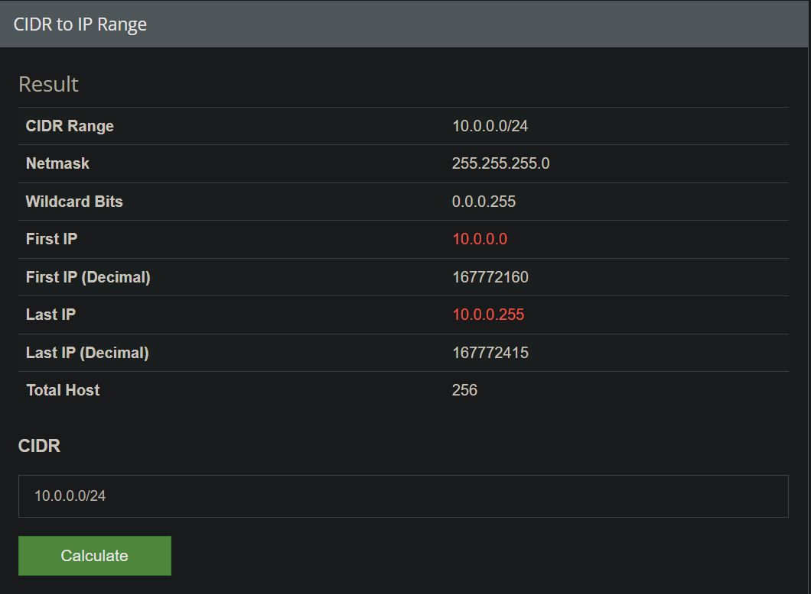

# VIRTUAL PRIVATE CLOUD

<div align="center">

</div>

## ⭐ IP Address

An IP address (Internet Protocol address) is a unique identifier assigned to each device connected to a computer network that uses the Internet Protocol for communication. It serves two main functions: identifying the host or network interface and providing the location of the host in the network.

> [!IMPORTANT]
> [0-255].[0-255].[0-255].[0-255]

### ⚡ Types of IP Addresses

1. **IPv4 (Internet Protocol version 4)**: 
   - Format: 32-bit numeric address written as four decimal numbers separated by periods (e.g., 192.168.1.1).
   - Range: Supports approximately 4.3 billion unique addresses.
   - Example: `192.168.0.1`

2. **IPv6 (Internet Protocol version 6)**:
   - Format: 128-bit address written as eight groups of four hexadecimal digits separated by colons (e.g., 2001:0db8:85a3:0000:0000:8a2e:0370:7334).
   - Range: Supports a vastly larger number of unique addresses (approximately 340 undecillion addresses).
   - Example: `2001:0db8:85a3:0000:0000:8a2e:0370:7334`

## ⭐ CIDR (Classless Inter Domain Routing)

CIDR (Classless Inter-Domain Routing) is a method for allocating IP addresses and IP routing. It was introduced to replace the old system of IP address classes (A, B, C) and to improve the allocation of IP addresses.

### ⚡ CIDR Notation

CIDR notation is a way to represent IP addresses and their associated routing prefix. An IP address is followed by a slash (/) and a number which specifies the length of the subnet mask.

```
IP_address/Subnet_prefix_length
```

#### 💻 Example

`192.168.1.0/24`: This denotes an IP address where the first 24 bits are used for the network part, and the remaining 8 bits are used for host addresses.

#### 💻 Example

`10.0.0.0/24`: --> `10.0.0.0` to `10.0.0.255`



Here is a table showing the IP ranges from `10.0.0.0/32` to `10.0.0.0/0` along with the total number of IPs for each range:

| CIDR Notation | Start IP      | End IP        | Total IPs         |
|---------------|---------------|---------------|-------------------|
| 10.0.0.0/32   | 10.0.0.0      | 10.0.0.0      | 1                 |
| 10.0.0.0/31   | 10.0.0.0      | 10.0.0.1      | 2                 |
| 10.0.0.0/30   | 10.0.0.0      | 10.0.0.3      | 4                 |
| 10.0.0.0/29   | 10.0.0.0      | 10.0.0.7      | 8                 |
| 10.0.0.0/28   | 10.0.0.0      | 10.0.0.15     | 16                |
| 10.0.0.0/27   | 10.0.0.0      | 10.0.0.31     | 32                |
| 10.0.0.0/26   | 10.0.0.0      | 10.0.0.63     | 64                |
| 10.0.0.0/25   | 10.0.0.0      | 10.0.0.127    | 128               |
| 10.0.0.0/24   | 10.0.0.0      | 10.0.0.255    | 256               |
| 10.0.0.0/23   | 10.0.0.0      | 10.0.1.255    | 512               |
| 10.0.0.0/22   | 10.0.0.0      | 10.0.3.255    | 1,024             |
| 10.0.0.0/21   | 10.0.0.0      | 10.0.7.255    | 2,048             |
| 10.0.0.0/20   | 10.0.0.0      | 10.0.15.255   | 4,096             |
| 10.0.0.0/19   | 10.0.0.0      | 10.0.31.255   | 8,192             |
| 10.0.0.0/18   | 10.0.0.0      | 10.0.63.255   | 16,384            |
| 10.0.0.0/17   | 10.0.0.0      | 10.0.127.255  | 32,768            |
| 10.0.0.0/16   | 10.0.0.0      | 10.0.255.255  | 65,536            |
| 10.0.0.0/15   | 10.0.0.0      | 10.1.255.255  | 131,072           |
| 10.0.0.0/14   | 10.0.0.0      | 10.3.255.255  | 262,144           |
| 10.0.0.0/13   | 10.0.0.0      | 10.7.255.255  | 524,288           |
| 10.0.0.0/12   | 10.0.0.0      | 10.15.255.255 | 1,048,576         |
| 10.0.0.0/11   | 10.0.0.0      | 10.31.255.255 | 2,097,152         |
| 10.0.0.0/10   | 10.0.0.0      | 10.63.255.255 | 4,194,304         |
| 10.0.0.0/9    | 10.0.0.0      | 10.127.255.255| 8,388,608         |
| 10.0.0.0/8    | 10.0.0.0      | 10.255.255.255| 16,777,216        |
| 10.0.0.0/7    | 10.0.0.0      | 11.255.255.255| 33,554,432        |
| 10.0.0.0/6    | 10.0.0.0      | 13.255.255.255| 67,108,864        |
| 10.0.0.0/5    | 10.0.0.0      | 15.255.255.255| 134,217,728       |
| 10.0.0.0/4    | 10.0.0.0      | 19.255.255.255| 268,435,456       |
| 10.0.0.0/3    | 10.0.0.0      | 23.255.255.255| 536,870,912       |
| 10.0.0.0/2    | 10.0.0.0      | 31.255.255.255| 1,073,741,824     |
| 10.0.0.0/1    | 10.0.0.0      | 63.255.255.255| 2,147,483,648     |
---

## ⭐ Algorithm

190.20.5.0/27 

=> 32 (number of hosts) - 27 => 5

=> 2 power 5 => 2 * 2 * 2 * 2 * 2

=> **32**

---

#### 💻 Example 

10.0.0.0/23 ---> 10.0.0.0 - 10.0.1.255 =>  total = 512

10.0.0.0 - 10.0.0.255 => 256

10.0.1.0 - 10.0.0.255 => 256

---

**8.8.8.8**

10.0.0.0/24 = 10.0.0.0 - 10.0.0.255 => total 256

`8.8.8`.8

---

10.0.0.0/16 = 10.0.0.0 - 10.0.255.255 => total 65536

`8.8`.8.8

---
10.0.0.0/8 = 10.0.0.0 - 10.255.255.255 => total 16777216

`8`.8.8.8

---

## ⭐ Public and Private Address